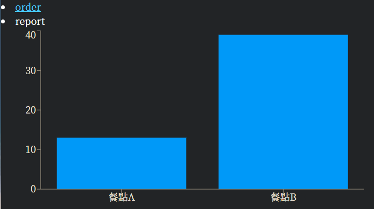

安裝相關套件+啟動後端
```
npm install
npm run server
```
切換到client並安裝+啟動前端[前端](https://github.com/IceTeaOxO/client)
```
cd client
npm install
npm start
```

## 專案目的
為學校附近的早午餐店做點餐系統，並提供店家圖表來進行簡單的數據統計。

## 架構簡介
後端server開在port5000，前端開在port3000。

餐點資訊、菜單都存在資料庫中，隨著使用者請求即時進行更改。

前端除了提供點餐頁面還有提供店員查看當前餐點訂單，以及提供當日餐點銷售圖表。


## Demo


點菜單會展開並顯示最新的菜單，目前只有先製作漢堡和土司的菜單。


因為餐點不提供外送，所以讓客人自己選取要取餐的時間，快到取餐時間店家才開始製作。


提供客人號碼，方便快速取餐。


這是菜單API的內容，前端根據該Data自動進行Render。


這是店家要製作的訂單資訊。


也提供基本的長條圖供店家判斷哪些品項賣得比較好。


